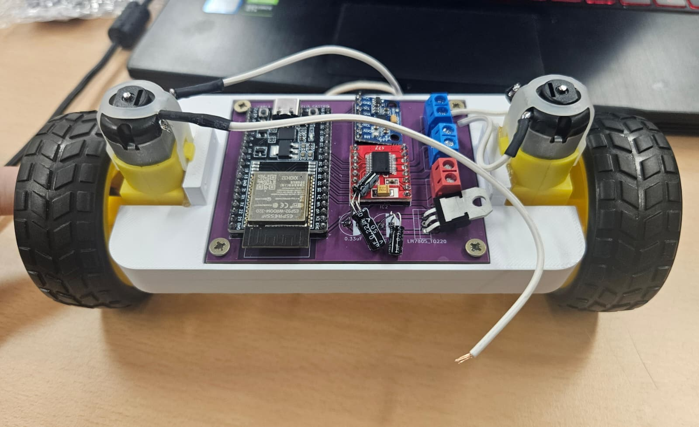

# Péndulo Invertido Autocontrolado

Proyecto académico de un **péndulo invertido autocontrolado (self-balancing robot)** basado en **ESP32** y control **PID**, diseñado para mantener el equilibrio de forma autónoma mediante sensores inerciales y control en tiempo real.



---

## Descripción del proyecto

Este repositorio recoge el desarrollo de un **robot autoequilibrado de dos ruedas**, integrando diseño mecánico, electrónica y programación embebida.

El sistema utiliza un **ESP32** como unidad principal de control, un sensor **MPU6050** para estimar la inclinación y un controlador **PID** encargado de actuar sobre los motores para mantener el equilibrio.

El proyecto incluye:

- Diseño mecánico del chasis mediante modelado 3D.
- Diseño electrónico mediante una PCB personalizada en **KiCad**.
- Programación embebida sobre **ESP32**.
- Implementación de control **PID** para estabilidad del sistema.

---

## Tecnologías utilizadas

### Hardware

- ESP32 DevKitC  
- MPU6050  
- TB6612FNG  
- LM7805  
- Motores DC con reductora  
- PCB personalizada  
- Chasis impreso en 3D  

### Software y herramientas

- ESP32 / Arduino Framework  
- KiCad  
- Fusion 360  
- Control PID discreto  
- Filtro complementario  

---

## Estructura del repositorio

```txt
Proyecto_Pendulo_Invertido/
│
├── README.md
├── costes.md
├── documentacion.md
│
├── assets/
├── electronica/
├── mecanica/
└── software/
```

### Documentación principal

- [`documentacion.md`](./documentacion.md) → Explicación técnica completa del sistema.
- [`costes.md`](./costes.md) → Coste aproximado de materiales y componentes.

### Carpetas del proyecto

- [`electronica/`](./electronica/) → Diseño PCB y archivos de KiCad.
- [`mecanica/`](./mecanica/) → Diseño del chasis y fabricación.
- [`software/`](./software/) → Código del sistema de control.
- [`assets/`](./assets/) → Recursos visuales del proyecto.

---

## Integrantes del proyecto

### Carla Freire Muíño  
GitHub: [@carlafreeire](https://github.com/carlafreeire)

### Noelia Castro Rodríguez  
GitHub: [@liln0e](https://github.com/liln0e)

---

## Licencia

Proyecto desarrollado con fines académicos y educativos.
